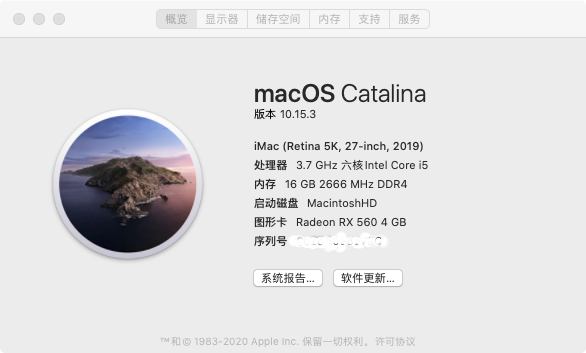
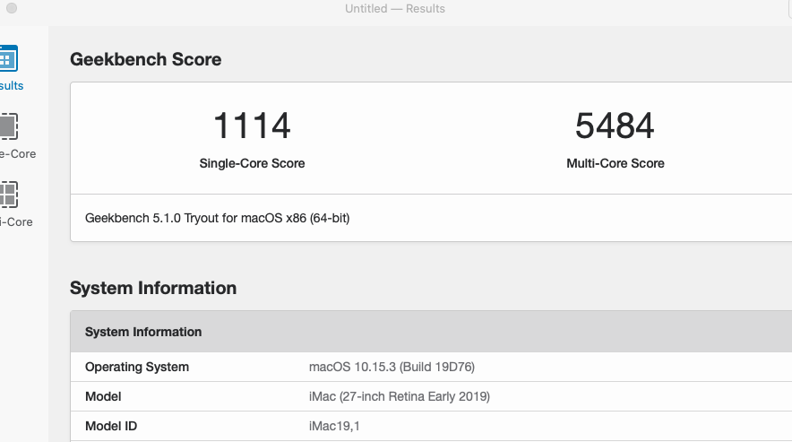
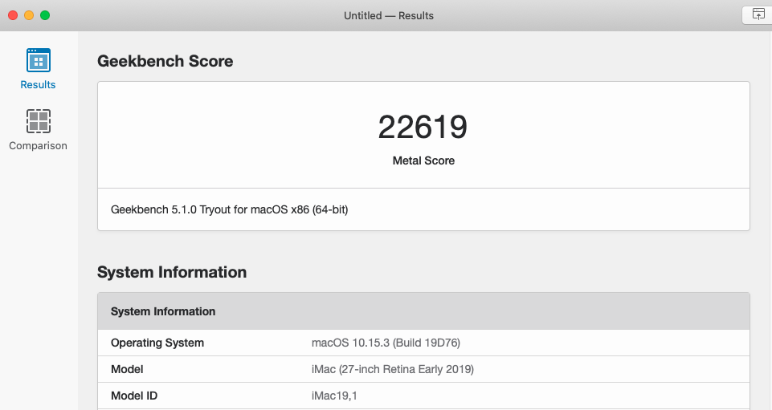

# 华硕TUF_B360M_GAMING_PLUS_S OpenCore引导
***
## EFI 介绍
OpenCore Version： 0.5.6
EFI 机型：iMac19,1

***
## 正常工作
- [x] 声卡（板载）/ 网卡（板载）
- [x] 显卡（核显 + 独显）/ 硬解 4K（HEVC + H.264）
- [x] WiFi（M.2_E 设备） / 蓝牙（M.2_E 设备）
- [x] 隔空投送 / 接力 / 随航
- [x] FaceTime / iMessage
- [x] Apple Music / Apple TV Plus
- [x] 睿频 / HWP 变频 / 原生电源管理
- [x] 睡眠 / 键盘、鼠标唤醒
- [x] 其他白果功能（99%）
***
## 配置清单
|         硬件       |                   型号                     | 
|-------------------:|:------------------------------------------|
|               主板 |  华硕TUF_B360M_GAMING_PLUS_S           |
|             处理器 | 英特尔酷睿 i5 9600K                    |
|               显卡 | RX 560D                               |
|               硬盘 |  海康威视C2000 256G                   |
|               内存 | 镁光 8GB DDR4 3000Mhz x 2          |
|        无线 + 蓝牙 |  BCM94360CD（双频 1750M + 蓝牙 4.0）+ M.2_E 无线网卡  |
***

## CPU跑分

***

## 显卡跑分

***

参考[1] [xjn 博客](https://blog.xjn819.com) 

参考[2] [黑果小兵博客](https://blog.daliansky.net)